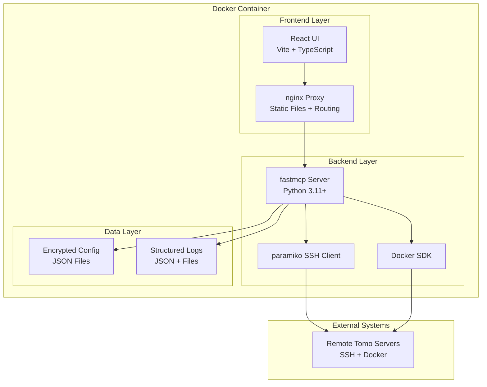
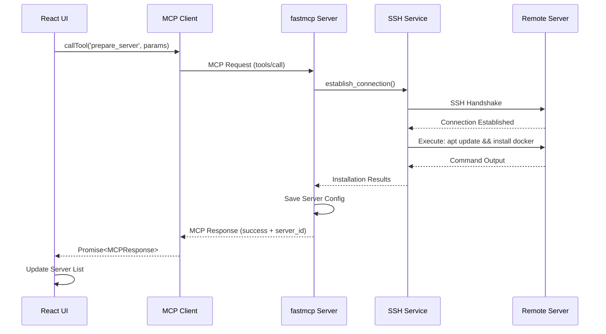
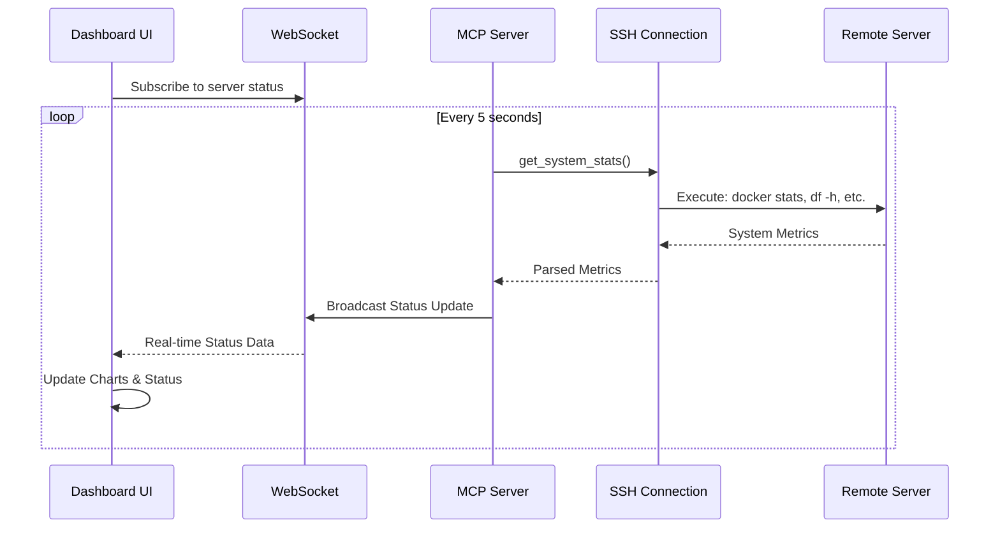
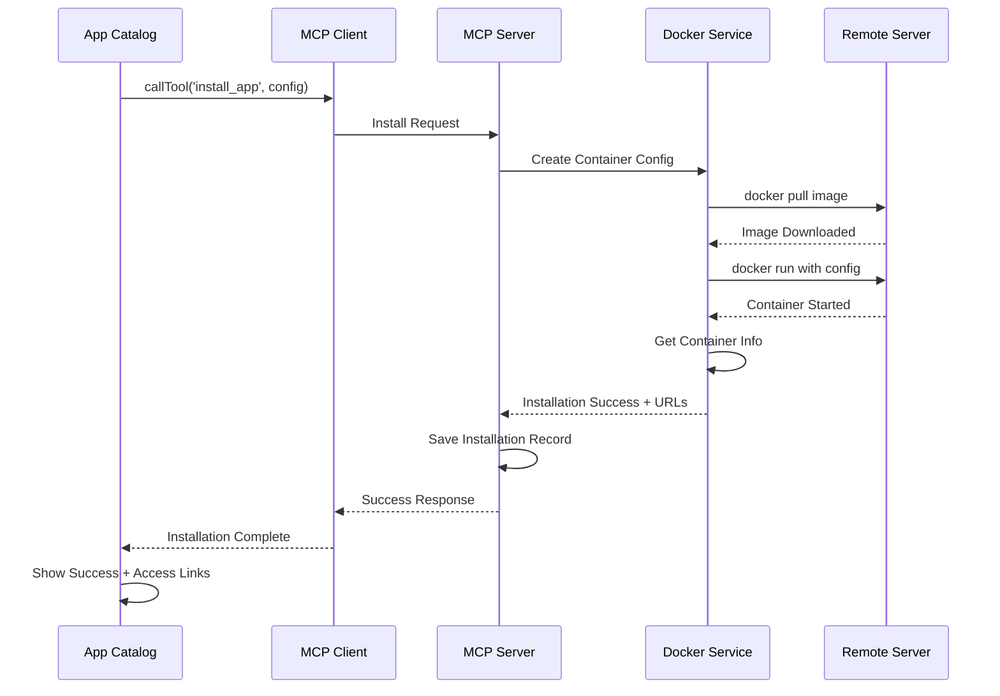

# Tomo System Architecture

## Table of Contents
1. [Architecture Overview](#architecture-overview)
2. [Component Architecture](#component-architecture)
3. [MCP Protocol Integration](#mcp-protocol-integration)
4. [Data Models](#data-models)
5. [Communication Flow](#communication-flow)
6. [Docker Containerization](#docker-containerization)
7. [Security Architecture](#security-architecture)
8. [Deployment Strategy](#deployment-strategy)
9. [Risk Assessment](#risk-assessment)
10. [Implementation Guidelines](#implementation-guidelines)

## Architecture Overview

### High-Level System Design



### Technology Stack

#### Frontend Stack
- **React 18+**: Modern functional components with hooks
- **TypeScript**: Type safety and better developer experience
- **Vite**: Fast development server and optimized production builds
- **Yarn**: Package management and workspace support
- **shadcn/ui**: Consistent, accessible UI components
- **TailwindCSS**: Utility-first styling system
- **React Context**: Global state management for MCP connections

#### Backend Stack
- **Python 3.11+**: Modern Python with performance improvements
- **fastmcp**: Model Context Protocol server framework
- **paramiko**: Pure Python SSH client library
- **Docker SDK**: Python interface to Docker Engine API
- **pydantic**: Data validation and settings management
- **structlog**: Structured logging with JSON output

#### Infrastructure Stack
- **Docker**: Containerization for consistent deployment
- **nginx**: Reverse proxy, static file serving, SSL termination
- **Docker Compose**: Development orchestration
- **Single Container**: Production deployment strategy

## Component Architecture

### Frontend Components

```
src/
├── components/
│   ├── layout/
│   │   ├── AppLayout.tsx          # Main application layout
│   │   ├── Navigation.tsx         # Navigation sidebar
│   │   └── Header.tsx             # Top header with status
│   ├── server/
│   │   ├── ServerList.tsx         # Server connection list
│   │   ├── ServerForm.tsx         # Add/edit server form
│   │   ├── ServerStatus.tsx       # Real-time server status
│   │   └── ConnectionTest.tsx     # SSH connection testing
│   ├── application/
│   │   ├── AppCatalog.tsx         # Browse available apps
│   │   ├── AppCard.tsx            # Individual app display
│   │   ├── InstallDialog.tsx      # App installation dialog
│   │   └── AppStatus.tsx          # Installed app status
│   ├── monitoring/
│   │   ├── Dashboard.tsx          # Main monitoring dashboard
│   │   ├── ResourceCharts.tsx     # CPU/RAM/Disk charts
│   │   ├── LogViewer.tsx          # System log display
│   │   └── ProgressTracker.tsx    # Installation progress
│   └── ui/                        # shadcn/ui components
│       ├── button.tsx
│       ├── dialog.tsx
│       └── ...
├── services/
│   ├── mcpClient.ts               # MCP protocol client
│   ├── serverService.ts           # Server management logic
│   └── applicationService.ts      # Application management logic
├── hooks/
│   ├── useMCP.ts                  # MCP connection hook
│   ├── useServers.ts              # Server state management
│   └── useApplications.ts         # Application state management
├── types/
│   ├── server.ts                  # Server-related types
│   ├── application.ts             # Application types
│   └── mcp.ts                     # MCP protocol types
└── lib/
    ├── validation.ts              # Input validation
    └── formatting.ts              # Data formatting utilities
```

### Backend Components

```
src/
├── main.py                        # FastMCP server entry point
├── tools/
│   ├── __init__.py
│   ├── server_tools.py            # Server management tools
│   ├── application_tools.py       # Application management tools
│   └── monitoring_tools.py        # Monitoring and status tools
├── services/
│   ├── ssh_service.py             # SSH connection management
│   ├── docker_service.py          # Docker operations
│   ├── config.py                  # Configuration management
│   └── log_service.py             # Logging utilities
├── models/
│   ├── server.py                  # Server data models
│   ├── application.py             # Application data models
│   └── response.py                # API response models
├── lib/
│   ├── encryption.py              # Credential encryption
│   ├── validation.py              # Input validation
│   └── exceptions.py              # Custom exceptions
└── init_db/
    ├── schema_logs.py             # Logs database schema
    └── schema_apps.py             # Application catalog schema & seeding
└── data/
    └── application_seed_data.py   # Initial application catalog entries
```

## MCP Protocol Integration

### MCP Tool Definitions

The backend exposes the following MCP tools for frontend consumption:

#### Server Management Tools

```python
@tool
async def prepare_server(
    host: str,
    port: int,
    username: str,
    auth_type: str,
    credentials: dict,
    server_name: str = None
) -> dict:
    """
    Prepare a remote server with Docker and dependencies.
    
    Args:
        host: Server IP address or hostname
        port: SSH port (default 22)
        username: SSH username
        auth_type: 'password' or 'key'
        credentials: {'password': str} or {'private_key': str, 'passphrase': str}
        server_name: Optional friendly name for the server
    
    Returns:
        {
            'success': bool,
            'server_id': str,
            'message': str,
            'preparation_log': list[str],
            'docker_version': str,
            'system_info': dict
        }
    """
```

```python
@tool
async def test_server_connection(
    server_id: str = None,
    host: str = None,
    port: int = None,
    username: str = None,
    auth_type: str = None,
    credentials: dict = None
) -> dict:
    """
    Test SSH connection to a server.
    
    Args:
        server_id: Existing server ID (for saved connections)
        OR provide connection details directly:
        host, port, username, auth_type, credentials
    
    Returns:
        {
            'success': bool,
            'message': str,
            'latency_ms': float,
            'server_info': {
                'os': str,
                'kernel': str,
                'architecture': str,
                'uptime': str
            }
        }
    """
```

#### Application Management Tools

```python
@tool
async def install_app(
    server_id: str,
    app_id: str,
    configuration: dict = None,
    custom_ports: list[int] = None,
    environment_variables: dict = None
) -> dict:
    """
    Install a containerized application on a server.
    
    Args:
        server_id: Target server identifier
        app_id: Application identifier from catalog
        configuration: App-specific configuration overrides
        custom_ports: Custom port mappings
        environment_variables: Additional environment variables
    
    Returns:
        {
            'success': bool,
            'installation_id': str,
            'message': str,
            'container_id': str,
            'access_urls': list[str],
            'installation_log': list[str]
        }
    """
```

```python
@tool
async def uninstall_app(
    server_id: str,
    app_name: str,
    remove_data: bool = False
) -> dict:
    """
    Uninstall an application and optionally remove its data.
    
    Args:
        server_id: Target server identifier
        app_name: Name of the installed application
        remove_data: Whether to remove persistent data volumes
    
    Returns:
        {
            'success': bool,
            'message': str,
            'cleanup_log': list[str],
            'removed_containers': list[str],
            'removed_volumes': list[str],
            'removed_images': list[str]
        }
    """
```

#### Monitoring Tools

```python
@tool
async def get_server_status(server_id: str) -> dict:
    """
    Get comprehensive server and application status.
    
    Args:
        server_id: Server identifier
    
    Returns:
        {
            'success': bool,
            'server_info': {
                'id': str,
                'name': str,
                'host': str,
                'status': 'online' | 'offline' | 'error',
                'last_seen': str,
                'uptime': str
            },
            'resources': {
                'cpu_percent': float,
                'memory_percent': float,
                'disk_usage': dict,
                'network_io': dict
            },
            'applications': list[{
                'name': str,
                'status': 'running' | 'stopped' | 'error',
                'container_id': str,
                'ports': list[int],
                'resource_usage': dict
            }]
        }
    """
```

```python
@tool
async def full_cleanup(
    server_id: str,
    confirm_cleanup: bool = False
) -> dict:
    """
    Perform complete server cleanup and reset.
    
    Args:
        server_id: Target server identifier
        confirm_cleanup: Safety confirmation flag
    
    Returns:
        {
            'success': bool,
            'message': str,
            'cleanup_summary': {
                'containers_removed': int,
                'images_removed': int,
                'volumes_removed': int,
                'networks_removed': int,
                'disk_space_freed': str
            },
            'cleanup_log': list[str]
        }
    """
```

### Frontend MCP Client

The frontend uses a custom MCP client to communicate with the backend:

```typescript
// services/mcpClient.ts
interface MCPClient {
  connect(): Promise<void>;
  disconnect(): Promise<void>;
  callTool<T>(name: string, params: object): Promise<MCPResponse<T>>;
  subscribeTo(events: string[]): EventSource;
  isConnected(): boolean;
}

interface MCPResponse<T> {
  success: boolean;
  data: T;
  error?: string;
  metadata?: {
    execution_time_ms: number;
    request_id: string;
    timestamp: string;
  };
}

class TomoMCPClient implements MCPClient {
  private transport: MCPTransport;
  private tools: Map<string, MCPTool>;
  
  constructor(serverUrl: string) {
    this.transport = new WebSocketMCPTransport(serverUrl);
  }
  
  async callTool<T>(name: string, params: object): Promise<MCPResponse<T>> {
    const request: MCPRequest = {
      method: 'tools/call',
      params: {
        name,
        arguments: params
      }
    };
    
    return await this.transport.send(request);
  }
}
```

### Usage Examples

```typescript
// hooks/useServers.ts
export function useServers() {
  const mcp = useMCP();
  const [servers, setServers] = useState<ServerConnection[]>([]);
  
  const addServer = async (connectionData: ServerConnectionData) => {
    const result = await mcp.callTool('prepare_server', {
      host: connectionData.host,
      port: connectionData.port,
      username: connectionData.username,
      auth_type: connectionData.authType,
      credentials: connectionData.credentials,
      server_name: connectionData.name
    });
    
    if (result.success) {
      setServers(prev => [...prev, result.data]);
    }
    
    return result;
  };
  
  return { servers, addServer };
}

// components/application/AppCatalog.tsx
export function AppCatalog() {
  const mcp = useMCP();
  const { selectedServer } = useServers();
  
  const installApp = async (appId: string, config: AppConfiguration) => {
    const result = await mcp.callTool('install_app', {
      server_id: selectedServer.id,
      app_id: appId,
      configuration: config.settings,
      custom_ports: config.ports,
      environment_variables: config.env
    });
    
    // Handle installation result
    if (result.success) {
      toast.success(`${appId} installed successfully`);
    } else {
      toast.error(`Failed to install ${appId}: ${result.error}`);
    }
  };
  
  return (
    // UI implementation
  );
}
```

## Data Models

### Core Data Models

```typescript
// types/server.ts
interface ServerConnection {
  id: string;
  name: string;
  host: string;
  port: number;
  username: string;
  auth_type: 'password' | 'key';
  created_at: string;
  last_connected: string;
  status: 'connected' | 'disconnected' | 'error' | 'preparing';
  system_info?: {
    os: string;
    kernel: string;
    architecture: string;
    docker_version?: string;
  };
}

interface ServerCredentials {
  server_id: string;
  auth_type: 'password' | 'key';
  encrypted_data: string; // AES-256 encrypted credentials
  created_at: string;
}

// types/application.ts
interface Application {
  id: string;
  name: string;
  display_name: string;
  description: string;
  category: 'media' | 'productivity' | 'networking' | 'monitoring' | 'storage';
  icon_url: string;
  docker_image: string;
  default_ports: PortMapping[];
  environment_variables: EnvironmentVariable[];
  volume_mounts: VolumeMount[];
  dependencies: string[];
  min_resources: ResourceRequirements;
  tags: string[];
}

interface PortMapping {
  container_port: number;
  host_port: number;
  protocol: 'tcp' | 'udp';
  description: string;
}

interface EnvironmentVariable {
  key: string;
  default_value?: string;
  description: string;
  required: boolean;
  type: 'string' | 'number' | 'boolean' | 'password';
}

interface VolumeMount {
  container_path: string;
  host_path: string;
  mode: 'ro' | 'rw';
  description: string;
}

interface InstalledApplication {
  id: string;
  server_id: string;
  app_id: string;
  name: string;
  container_id: string;
  status: 'running' | 'stopped' | 'error' | 'installing' | 'uninstalling';
  ports: PortMapping[];
  access_urls: string[];
  installed_at: string;
  updated_at: string;
  resource_usage?: {
    cpu_percent: number;
    memory_mb: number;
    network_io: {
      rx_bytes: number;
      tx_bytes: number;
    };
  };
}
```

### Backend Data Models

```python
# models/server.py
from pydantic import BaseModel, Field
from typing import Optional, Dict, Any
from enum import Enum

class AuthType(str, Enum):
    PASSWORD = "password"
    KEY = "key"

class ServerStatus(str, Enum):
    CONNECTED = "connected"
    DISCONNECTED = "disconnected"
    ERROR = "error"
    PREPARING = "preparing"

class ServerConnection(BaseModel):
    id: str = Field(..., description="Unique server identifier")
    name: str = Field(..., description="Human-readable server name")
    host: str = Field(..., description="Server hostname or IP")
    port: int = Field(default=22, description="SSH port")
    username: str = Field(..., description="SSH username")
    auth_type: AuthType = Field(..., description="Authentication method")
    created_at: str = Field(..., description="ISO timestamp")
    last_connected: Optional[str] = Field(None, description="Last connection timestamp")
    status: ServerStatus = Field(default=ServerStatus.DISCONNECTED)
    system_info: Optional[Dict[str, Any]] = Field(None, description="System information")

class ServerCredentials(BaseModel):
    server_id: str
    encrypted_password: Optional[str] = None
    encrypted_private_key: Optional[str] = None
    encrypted_passphrase: Optional[str] = None

# models/application.py
class ApplicationStatus(str, Enum):
    RUNNING = "running"
    STOPPED = "stopped"
    ERROR = "error"
    INSTALLING = "installing"
    UNINSTALLING = "uninstalling"

class Application(BaseModel):
    id: str = Field(..., description="Unique application identifier")
    name: str = Field(..., description="Application name")
    display_name: str = Field(..., description="Human-readable name")
    description: str = Field(..., description="Application description")
    category: str = Field(..., description="Application category")
    docker_image: str = Field(..., description="Docker image name:tag")
    default_ports: list[Dict[str, Any]] = Field(default_factory=list)
    environment_variables: list[Dict[str, Any]] = Field(default_factory=list)
    volume_mounts: list[Dict[str, Any]] = Field(default_factory=list)
    dependencies: list[str] = Field(default_factory=list)

class InstalledApplication(BaseModel):
    id: str = Field(..., description="Installation identifier")
    server_id: str = Field(..., description="Target server ID")
    app_id: str = Field(..., description="Application ID")
    name: str = Field(..., description="Installation name")
    container_id: str = Field(..., description="Docker container ID")
    status: ApplicationStatus = Field(default=ApplicationStatus.INSTALLING)
    ports: list[Dict[str, Any]] = Field(default_factory=list)
    access_urls: list[str] = Field(default_factory=list)
    installed_at: str = Field(..., description="Installation timestamp")
    updated_at: str = Field(..., description="Last update timestamp")
```

## Communication Flow

### MCP Request/Response Flow



### Real-time Monitoring Flow



### Application Installation Flow



## Docker Containerization

### Single Container Architecture

The application is packaged as a single Docker container with multiple services:

```dockerfile
# Dockerfile
FROM node:18-alpine AS frontend-build
WORKDIR /app/frontend
COPY frontend/package.json frontend/yarn.lock ./
RUN yarn install --frozen-lockfile
COPY frontend/ .
RUN yarn build

FROM python:3.11-alpine AS backend-build
WORKDIR /app/backend
COPY backend/requirements.txt .
RUN pip install --no-cache-dir -r requirements.txt
COPY backend/ .

FROM nginx:alpine AS production
# Install Python and dependencies
RUN apk add --no-cache python3 py3-pip supervisor
COPY --from=backend-build /app/backend /app/backend
COPY --from=frontend-build /app/frontend/dist /usr/share/nginx/html

# nginx configuration
COPY docker/nginx.conf /etc/nginx/nginx.conf
COPY docker/supervisord.conf /etc/supervisord.conf

EXPOSE 80 8000
CMD ["/usr/bin/supervisord", "-c", "/etc/supervisord.conf"]
```

### nginx Configuration

```nginx
# docker/nginx.conf
events {
    worker_connections 1024;
}

http {
    include       /etc/nginx/mime.types;
    default_type  application/octet-stream;
    
    upstream mcp_backend {
        server 127.0.0.1:8000;
    }
    
    server {
        listen 80;
        server_name localhost;
        
        # Serve React app
        location / {
            root /usr/share/nginx/html;
            try_files $uri $uri/ /index.html;
            
            # Security headers
            add_header X-Frame-Options DENY;
            add_header X-Content-Type-Options nosniff;
            add_header X-XSS-Protection "1; mode=block";
        }
        
        # Proxy MCP requests to backend
        location /api/ {
            proxy_pass http://mcp_backend/;
            proxy_set_header Host $host;
            proxy_set_header X-Real-IP $remote_addr;
            proxy_set_header X-Forwarded-For $proxy_add_x_forwarded_for;
            proxy_set_header X-Forwarded-Proto $scheme;
            
            # WebSocket support for MCP
            proxy_http_version 1.1;
            proxy_set_header Upgrade $http_upgrade;
            proxy_set_header Connection "upgrade";
        }
        
        # Health check endpoint
        location /health {
            access_log off;
            return 200 "healthy\n";
            add_header Content-Type text/plain;
        }
    }
}
```

### Process Supervision

```ini
# docker/supervisord.conf
[supervisord]
nodaemon=true
user=root

[program:nginx]
command=nginx -g "daemon off;"
autostart=true
autorestart=true
stdout_logfile=/var/log/nginx.out.log
stderr_logfile=/var/log/nginx.err.log

[program:mcp_server]
command=python -m uvicorn main:app --host 0.0.0.0 --port 8000
directory=/app/backend
autostart=true
autorestart=true
stdout_logfile=/var/log/mcp_server.out.log
stderr_logfile=/var/log/mcp_server.err.log
environment=PYTHONPATH="/app/backend"
```

### Development Docker Compose

```yaml
# docker-compose.dev.yml
version: '3.8'

services:
  tomo:
    build:
      context: .
      dockerfile: Dockerfile.dev
    ports:
      - "3000:3000"  # Vite dev server
      - "8000:8000"  # MCP server
    volumes:
      - ./frontend:/app/frontend
      - ./backend:/app/backend
      - /var/run/docker.sock:/var/run/docker.sock
    environment:
      - NODE_ENV=development
      - PYTHON_ENV=development
      - MCP_LOG_LEVEL=DEBUG
    command: |
      sh -c "
        cd /app/backend && python -m uvicorn main:app --host 0.0.0.0 --port 8000 --reload &
        cd /app/frontend && yarn dev --host 0.0.0.0 --port 3000
      "
```

## Security Architecture

### Credential Management

```python
# lib/encryption.py
import os
import base64
from cryptography.fernet import Fernet
from cryptography.hazmat.primitives import hashes
from cryptography.hazmat.primitives.kdf.pbkdf2 import PBKDF2HMAC

class CredentialManager:
    def __init__(self, master_password: str):
        self.key = self._derive_key(master_password)
        self.cipher = Fernet(self.key)
    
    def _derive_key(self, password: str) -> bytes:
        password_bytes = password.encode()
        salt = os.environ.get('TOMO_SALT', 'default-salt').encode()
        kdf = PBKDF2HMAC(
            algorithm=hashes.SHA256(),
            length=32,
            salt=salt,
            iterations=100000,
        )
        key = base64.urlsafe_b64encode(kdf.derive(password_bytes))
        return key
    
    def encrypt_credentials(self, credentials: dict) -> str:
        """Encrypt SSH credentials for storage."""
        import json
        credentials_json = json.dumps(credentials)
        encrypted_data = self.cipher.encrypt(credentials_json.encode())
        return base64.urlsafe_b64encode(encrypted_data).decode()
    
    def decrypt_credentials(self, encrypted_data: str) -> dict:
        """Decrypt stored SSH credentials."""
        import json
        encrypted_bytes = base64.urlsafe_b64decode(encrypted_data.encode())
        decrypted_data = self.cipher.decrypt(encrypted_bytes)
        return json.loads(decrypted_data.decode())
```

### SSH Security Configuration

```python
# services/ssh_service.py
import paramiko
from typing import Dict, Any
import logging

class SecureSSHService:
    def __init__(self):
        self.logger = logging.getLogger(__name__)
        # Configure secure SSH client
        self.ssh_config = {
            'timeout': 30,
            'auth_timeout': 10,
            'banner_timeout': 30,
            'compress': True
        }
    
    def create_ssh_client(self) -> paramiko.SSHClient:
        """Create a securely configured SSH client."""
        client = paramiko.SSHClient()
        
        # Only allow known host keys
        client.set_missing_host_key_policy(paramiko.RejectPolicy())
        
        # Configure security settings
        client.get_transport().set_keepalive(30)
        
        return client
    
    async def establish_connection(
        self,
        host: str,
        port: int,
        username: str,
        credentials: Dict[str, Any]
    ) -> paramiko.SSHClient:
        """Establish a secure SSH connection."""
        client = self.create_ssh_client()
        
        try:
            if credentials.get('auth_type') == 'password':
                client.connect(
                    hostname=host,
                    port=port,
                    username=username,
                    password=credentials['password'],
                    **self.ssh_config
                )
            else:  # SSH key authentication
                private_key = paramiko.RSAKey.from_private_key_file(
                    credentials['private_key_path'],
                    password=credentials.get('passphrase')
                )
                client.connect(
                    hostname=host,
                    port=port,
                    username=username,
                    pkey=private_key,
                    **self.ssh_config
                )
            
            return client
            
        except Exception as e:
            self.logger.error(f"SSH connection failed: {e}")
            client.close()
            raise
```

### Input Validation

```python
# lib/validation.py
from pydantic import BaseModel, validator, Field
import ipaddress
import re

class ServerConnectionInput(BaseModel):
    host: str = Field(..., min_length=1, max_length=255)
    port: int = Field(default=22, ge=1, le=65535)
    username: str = Field(..., min_length=1, max_length=255)
    auth_type: str = Field(..., regex=r'^(password|key)$')
    
    @validator('host')
    def validate_host(cls, v):
        # Check if it's a valid IP address
        try:
            ipaddress.ip_address(v)
            return v
        except ValueError:
            pass
        
        # Check if it's a valid hostname
        hostname_pattern = r'^[a-zA-Z0-9]([a-zA-Z0-9-]{0,61}[a-zA-Z0-9])?(\.[a-zA-Z0-9]([a-zA-Z0-9-]{0,61}[a-zA-Z0-9])?)*$'
        if not re.match(hostname_pattern, v):
            raise ValueError('Invalid host format')
        
        return v
    
    @validator('username')
    def validate_username(cls, v):
        # Unix username validation
        username_pattern = r'^[a-z_]([a-z0-9_-]{0,31}|[a-z0-9_-]{0,30}\$)$'
        if not re.match(username_pattern, v):
            raise ValueError('Invalid username format')
        
        return v

class ApplicationInstallInput(BaseModel):
    server_id: str = Field(..., min_length=1)
    app_id: str = Field(..., min_length=1)
    configuration: dict = Field(default_factory=dict)
    custom_ports: list[int] = Field(default_factory=list)
    
    @validator('custom_ports')
    def validate_ports(cls, v):
        for port in v:
            if not (1 <= port <= 65535):
                raise ValueError(f'Invalid port number: {port}')
        return v
```

## Deployment Strategy

### Production Deployment

```bash
# Production deployment script
#!/bin/bash
set -e

# Build production image
docker build -t tomo:latest .

# Run with security configurations
docker run -d \
  --name tomo \
  --restart unless-stopped \
  -p 80:80 \
  -v tomo_data:/app/data \
  -v /var/run/docker.sock:/var/run/docker.sock:ro \
  --security-opt no-new-privileges \
  --read-only \
  --tmpfs /tmp:rw,noexec,nosuid,size=100m \
  --tmpfs /var/run:rw,noexec,nosuid,size=50m \
  --tmpfs /var/cache/nginx:rw,noexec,nosuid,size=10m \
  -e TOMO_MASTER_PASSWORD="${TOMO_MASTER_PASSWORD}" \
  -e TOMO_SALT="${TOMO_SALT}" \
  tomo:latest
```

### Environment Configuration

```bash
# .env.production
TOMO_MASTER_PASSWORD=secure_master_password_here
TOMO_SALT=unique_salt_for_encryption
MCP_LOG_LEVEL=INFO
SSH_CONNECTION_TIMEOUT=30
MAX_CONCURRENT_CONNECTIONS=10
DATA_DIRECTORY=/app/data
LOG_DIRECTORY=/app/logs
```

### Health Monitoring

```python
# Backend health check endpoint
@app.get("/health")
async def health_check():
    """Comprehensive health check for the application."""
    health_status = {
        "status": "healthy",
        "timestamp": datetime.utcnow().isoformat(),
        "components": {}
    }
    
    # Check MCP server status
    try:
        health_status["components"]["mcp_server"] = "healthy"
    except Exception as e:
        health_status["components"]["mcp_server"] = f"unhealthy: {e}"
        health_status["status"] = "degraded"
    
    # Check data directory access
    try:
        data_dir = Path(settings.DATA_DIRECTORY)
        if data_dir.exists() and data_dir.is_dir():
            health_status["components"]["data_directory"] = "healthy"
        else:
            health_status["components"]["data_directory"] = "unhealthy: directory not accessible"
            health_status["status"] = "unhealthy"
    except Exception as e:
        health_status["components"]["data_directory"] = f"unhealthy: {e}"
        health_status["status"] = "unhealthy"
    
    # Return appropriate HTTP status
    if health_status["status"] == "healthy":
        return health_status
    elif health_status["status"] == "degraded":
        raise HTTPException(status_code=503, detail=health_status)
    else:
        raise HTTPException(status_code=503, detail=health_status)
```

## Risk Assessment

### High Priority Risks

#### 1. SSH Credential Security
**Risk**: Compromise of SSH credentials stored in the application
**Impact**: Complete access to managed servers
**Mitigation Strategies**:
- AES-256 encryption for all stored credentials
- Master password protection with PBKDF2 key derivation
- No plaintext credential storage
- Automatic credential rotation recommendations
- Read-only container filesystem

#### 2. Container Privilege Escalation
**Risk**: Attackers gaining host system access via container escape
**Impact**: Compromise of hosting system
**Mitigation Strategies**:
- Run containers with minimal privileges
- Use read-only root filesystem
- Implement security contexts and user namespaces
- Regular security updates and vulnerability scanning
- Network isolation between containers

#### 3. SSH Connection Hijacking
**Risk**: Man-in-the-middle attacks on SSH connections
**Impact**: Unauthorized access to remote servers
**Mitigation Strategies**:
- Strict host key verification
- SSH key-based authentication preferred over passwords
- Connection encryption validation
- Audit logging for all SSH operations
- Connection timeout and retry limits

### Medium Priority Risks

#### 4. Resource Exhaustion
**Risk**: Excessive resource usage causing service degradation
**Impact**: Application unavailability or poor performance
**Mitigation Strategies**:
- Connection pooling and limits
- Request rate limiting
- Resource monitoring and alerts
- Graceful degradation under load
- Container resource limits

#### 5. Data Loss
**Risk**: Loss of server configurations and application data
**Impact**: Need to reconfigure all managed servers
**Mitigation Strategies**:
- Encrypted data persistence
- Regular backup recommendations
- Export/import functionality
- Version control for configurations
- Recovery procedures documentation

### Low Priority Risks

#### 6. UI/UX Complexity
**Risk**: Interface becoming too complex for target users
**Impact**: Poor user adoption and satisfaction
**Mitigation Strategies**:
- User testing and feedback collection
- Progressive disclosure of advanced features
- Comprehensive help documentation
- Intuitive navigation patterns
- Accessibility compliance

## Implementation Guidelines

### Development Phases

#### Phase 1: Foundation (Weeks 1-2)
**Technical Tasks**:
1. Set up project structure with monorepo approach
2. Configure Vite for React frontend with TypeScript
3. Implement basic fastmcp server with health endpoints
4. Create Docker development environment
5. Set up CI/CD pipeline with GitHub Actions

**Deliverables**:
- Working development environment
- Basic project scaffolding
- Container builds successfully
- Health checks functional

#### Phase 2: Core MCP Integration (Weeks 3-4)
**Technical Tasks**:
1. Implement MCP client in React frontend
2. Create server connection management MCP tools
3. Implement SSH service with paramiko
4. Add credential encryption and storage
5. Build connection testing and validation

**Deliverables**:
- MCP communication working
- SSH connections established
- Credential storage secure
- Connection testing functional

#### Phase 3: Server Management (Weeks 5-6)
**Technical Tasks**:
1. Implement `prepare_server()` MCP tool
2. Create server preparation UI workflows
3. Add Docker installation and validation
4. Implement system dependency checks
5. Build preparation progress tracking

**Deliverables**:
- Server preparation automated
- Docker installation working
- Progress feedback visible
- Error handling implemented

#### Phase 4: Application Management (Weeks 7-8)
**Technical Tasks**:
1. Create application catalog system
2. Implement `install_app()` and `uninstall_app()` tools
3. Build application browsing and selection UI
4. Add Docker container management
5. Implement installation progress tracking

**Deliverables**:
- Application catalog functional
- Installation/uninstallation working
- Container management implemented
- User feedback systems working

#### Phase 5: Monitoring & Cleanup (Weeks 9-10)
**Technical Tasks**:
1. Implement `get_server_status()` tool
2. Create real-time monitoring dashboard
3. Add `full_cleanup()` functionality
4. Build log viewing and filtering
5. Implement resource usage monitoring

**Deliverables**:
- Real-time monitoring working
- System cleanup functional
- Log viewing implemented
- Resource monitoring accurate

#### Phase 6: Production Readiness (Weeks 11-12)
**Technical Tasks**:
1. Create production Docker image with nginx
2. Implement comprehensive security measures
3. Add performance optimizations
4. Create deployment documentation
5. Implement monitoring and alerting

**Deliverables**:
- Production-ready container
- Security audit passed
- Performance benchmarks met
- Deployment documentation complete

### Code Quality Standards

#### Frontend Standards
- **TypeScript**: Strict mode with exact types
- **Component Architecture**: Functional components with hooks
- **State Management**: React Context with useReducer for complex state
- **Testing**: Vitest for unit tests, Playwright for E2E
- **Code Style**: Prettier + ESLint with strict rules

#### Backend Standards
- **Type Safety**: Pydantic models for all data structures
- **Error Handling**: Comprehensive exception handling with logging
- **Testing**: pytest with >90% code coverage
- **Code Style**: Black formatting + flake8 linting
- **Security**: Input validation, secure defaults, audit logging

### Performance Requirements

#### Frontend Performance
- Initial page load: < 3 seconds
- Route transitions: < 500ms
- Real-time updates: 5-second intervals
- Bundle size: < 2MB gzipped

#### Backend Performance
- MCP tool response time: < 10 seconds for most operations
- SSH connection establishment: < 30 seconds
- Concurrent connection handling: 10+ simultaneous
- Memory usage: < 512MB under normal load

### Monitoring and Observability

#### Application Metrics
- Request/response times for all MCP tools
- SSH connection success/failure rates
- Container resource usage
- Error rates and types

#### Infrastructure Metrics
- Container health status
- Resource utilization (CPU, memory, disk)
- Network connectivity status
- Storage usage trends

#### Logging Strategy
- Structured JSON logs with correlation IDs
- Separate log levels for development and production
- Sensitive data filtering (credentials, keys)
- Centralized log aggregation ready

### Security Checklist

#### Development Security
- [ ] Input validation on all user inputs
- [ ] SQL injection prevention (though using JSON storage)
- [ ] XSS protection in React components
- [ ] CSRF protection for state-changing operations
- [ ] Secure credential storage implementation

#### Deployment Security
- [ ] Container runs with non-root user
- [ ] Read-only filesystem where possible
- [ ] Network policies restrict unnecessary access
- [ ] Regular security scanning of dependencies
- [ ] SSL/TLS termination at nginx layer

#### Operational Security
- [ ] Regular backup procedures established
- [ ] Access logs retained and monitored
- [ ] Incident response procedures documented
- [ ] Security update procedures established
- [ ] Penetration testing completed

---

**Document Version**: 1.0  
**Last Updated**: September 5, 2025  
**Next Review**: September 19, 2025
