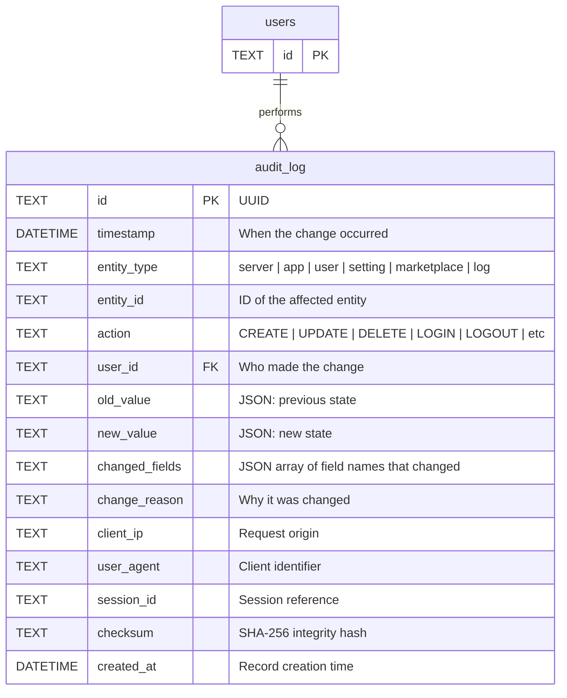

# Unified Audit Schema Proposal

## Current State

Fragmented audit approach:
- `settings_audit` - Settings only (automatic triggers, checksums)
- `activity_logs` - General activity (manual, inconsistent)
- No audit for: servers, apps, marketplace, users/auth

## Proposed Design

### Option A: Single Unified Audit Table

One table to rule them all - tracks changes across all domains.



**Entity Types:**
| entity_type | Tracks |
|-------------|--------|
| `user` | User CRUD, role changes, profile updates |
| `auth` | Login, logout, failed login, password change, 2FA |
| `server` | Server CRUD, credential changes, status changes |
| `app` | Application CRUD, installations, status changes |
| `marketplace` | Repo CRUD, app imports, ratings |
| `setting` | System and user setting changes |
| `log` | Log retention actions (purge, export) |

**Actions:**
| Action | Description |
|--------|-------------|
| `CREATE` | Entity created |
| `UPDATE` | Entity modified |
| `DELETE` | Entity deleted |
| `LOGIN` | User login success |
| `LOGOUT` | User logout |
| `LOGIN_FAILED` | Failed login attempt |
| `PASSWORD_CHANGE` | Password updated |
| `INSTALL` | App installed on server |
| `UNINSTALL` | App removed from server |
| `START` | Container started |
| `STOP` | Container stopped |
| `IMPORT` | Marketplace app imported |
| `SYNC` | Marketplace repo synced |
| `PURGE` | Logs purged |
| `EXPORT` | Data exported |
| `BACKUP` | Backup created |
| `RESTORE` | Backup restored |

---

### Option B: Domain-Specific Audit Tables

Separate tables per domain with consistent structure.

```mermaid
erDiagram
    audit_auth {
        TEXT id PK
        DATETIME timestamp
        TEXT user_id FK
        TEXT action "LOGIN | LOGOUT | LOGIN_FAILED | PASSWORD_CHANGE | 2FA_ENABLED"
        TEXT client_ip
        TEXT user_agent
        TEXT session_id
        TEXT details "JSON"
        TEXT checksum
    }

    audit_users {
        TEXT id PK
        DATETIME timestamp
        TEXT user_id FK
        TEXT target_user_id
        TEXT action "CREATE | UPDATE | DELETE | ROLE_CHANGE"
        TEXT old_value "JSON"
        TEXT new_value "JSON"
        TEXT change_reason
        TEXT client_ip
        TEXT checksum
    }

    audit_servers {
        TEXT id PK
        DATETIME timestamp
        TEXT user_id FK
        TEXT server_id FK
        TEXT action "CREATE | UPDATE | DELETE | CONNECT | DISCONNECT | CREDENTIAL_CHANGE"
        TEXT old_value "JSON"
        TEXT new_value "JSON"
        TEXT change_reason
        TEXT client_ip
        TEXT checksum
    }

    audit_apps {
        TEXT id PK
        DATETIME timestamp
        TEXT user_id FK
        TEXT app_id
        TEXT server_id
        TEXT action "CREATE | UPDATE | DELETE | INSTALL | UNINSTALL | START | STOP"
        TEXT old_value "JSON"
        TEXT new_value "JSON"
        TEXT change_reason
        TEXT client_ip
        TEXT checksum
    }

    audit_marketplace {
        TEXT id PK
        DATETIME timestamp
        TEXT user_id FK
        TEXT entity_type "repo | app | rating"
        TEXT entity_id
        TEXT action "CREATE | UPDATE | DELETE | SYNC | IMPORT | RATE"
        TEXT old_value "JSON"
        TEXT new_value "JSON"
        TEXT client_ip
        TEXT checksum
    }

    audit_settings {
        TEXT id PK
        DATETIME timestamp
        TEXT user_id FK
        TEXT setting_type "system | user"
        TEXT setting_key
        TEXT old_value "JSON"
        TEXT new_value "JSON"
        TEXT change_reason
        TEXT client_ip
        TEXT checksum
    }
```



---

## Recommendation: Option A (Unified)

**Pros:**
- Single source of truth for all audit data
- Easy cross-domain queries ("show all actions by user X")
- Consistent structure and indexing
- Simpler maintenance and backup
- One set of triggers/code to maintain

**Cons:**
- Larger table (but can partition by date or entity_type)
- Some fields may be null for certain entity types

---

## Proposed Schema (Option A)

```sql
CREATE TABLE audit_log (
    id TEXT PRIMARY KEY,
    timestamp DATETIME NOT NULL DEFAULT (datetime('now', 'utc')),

    -- What changed
    entity_type TEXT NOT NULL,
    entity_id TEXT NOT NULL,
    action TEXT NOT NULL,

    -- Who changed it
    user_id TEXT,
    session_id TEXT,

    -- Change details
    old_value TEXT,  -- JSON
    new_value TEXT,  -- JSON
    changed_fields TEXT,  -- JSON array
    change_reason TEXT,

    -- Request context
    client_ip TEXT,
    user_agent TEXT,

    -- Integrity
    checksum TEXT NOT NULL,
    created_at DATETIME NOT NULL DEFAULT (datetime('now', 'utc')),

    -- Constraints
    CONSTRAINT chk_entity_type CHECK (
        entity_type IN ('user', 'auth', 'server', 'app', 'marketplace', 'setting', 'log', 'backup')
    ),
    CONSTRAINT chk_action CHECK (
        action IN (
            'CREATE', 'UPDATE', 'DELETE',
            'LOGIN', 'LOGOUT', 'LOGIN_FAILED', 'PASSWORD_CHANGE', '2FA_CHANGE',
            'INSTALL', 'UNINSTALL', 'START', 'STOP', 'RESTART',
            'IMPORT', 'SYNC', 'RATE',
            'PURGE', 'EXPORT', 'BACKUP', 'RESTORE',
            'CONNECT', 'DISCONNECT', 'CREDENTIAL_CHANGE'
        )
    ),
    CONSTRAINT chk_checksum CHECK (
        checksum IS NOT NULL AND length(checksum) = 64
    )
);

-- Performance indexes
CREATE INDEX idx_audit_timestamp ON audit_log(timestamp);
CREATE INDEX idx_audit_entity ON audit_log(entity_type, entity_id);
CREATE INDEX idx_audit_user ON audit_log(user_id);
CREATE INDEX idx_audit_action ON audit_log(action);
CREATE INDEX idx_audit_type_action ON audit_log(entity_type, action);
CREATE INDEX idx_audit_checksum ON audit_log(checksum);

-- Composite index for common queries
CREATE INDEX idx_audit_user_timestamp ON audit_log(user_id, timestamp);
CREATE INDEX idx_audit_entity_timestamp ON audit_log(entity_type, timestamp);
```

---

## Migration Plan

### Phase 1: Create New Table
1. Create `audit_log` table
2. Add indexes

### Phase 2: Migrate Existing Data
1. Migrate `settings_audit` → `audit_log` (entity_type='setting')
2. Migrate relevant `activity_logs` → `audit_log`

### Phase 3: Update Application Code
1. Create unified `AuditService`
2. Update all domains to use new service
3. Add automatic triggers where appropriate

### Phase 4: Cleanup
1. Drop `settings_audit` table
2. Drop or repurpose `activity_logs` table
3. Update documentation

---

## Tables to Remove

| Current Table | Replacement |
|---------------|-------------|
| `settings_audit` | `audit_log` (entity_type='setting') |
| `activity_logs` | `audit_log` (various entity_types) |

---

## Final Table Count

**Before:** 18 tables (including `settings_audit` and `activity_logs`)
**After:** 17 tables (unified `audit_log`)

---

## Design Decisions

### Retention Policy
Handled via `system_settings` - not hardcoded in schema:
```
retention.audit_log_days = 90
retention.logs_days = 30
retention.metrics_days = 7
```
A scheduled job reads these settings and purges old records.

### Sensitive Data
`old_value`/`new_value` should **exclude** sensitive fields:
- Passwords / password hashes
- Private keys
- Encrypted credentials
- API tokens

For credential changes, log that it changed but not the actual values:
```json
{"changed_fields": ["password"], "password": "[REDACTED]"}
```

### Triggers vs Application Code
Use **application code** (not DB triggers) because:
- More control over what gets logged
- Can redact sensitive data before logging
- Easier to test and debug
- Works consistently across DB engines
