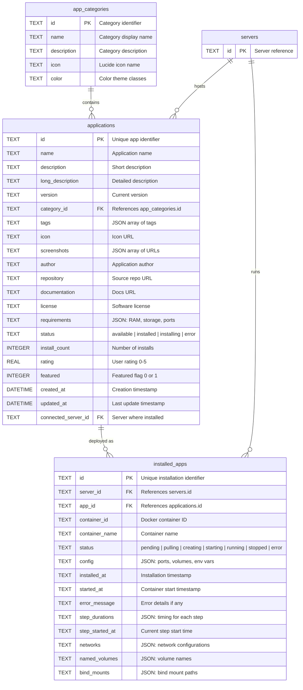

# Applications & Deployment

## Entity Relationship Diagram

## Tables

### `app_categories`
Application category definitions.

| Column | Type | Constraints | Description |
|--------|------|-------------|-------------|
| `id` | TEXT | PRIMARY KEY | Category identifier |
| `name` | TEXT | NOT NULL | Display name |
| `description` | TEXT | NOT NULL | Description |
| `icon` | TEXT | NOT NULL | Lucide icon name |
| `color` | TEXT | NOT NULL | Theme color classes |

---

### `applications`
Local application catalog entries.

| Column | Type | Constraints | Description |
|--------|------|-------------|-------------|
| `id` | TEXT | PRIMARY KEY | Application identifier |
| `name` | TEXT | NOT NULL | Application name |
| `description` | TEXT | NOT NULL | Short description |
| `long_description` | TEXT | | Detailed description |
| `version` | TEXT | NOT NULL | Version string |
| `category_id` | TEXT | NOT NULL, FK | Category reference |
| `tags` | TEXT | | JSON array of tags |
| `icon` | TEXT | | Icon URL |
| `screenshots` | TEXT | | JSON array of URLs |
| `author` | TEXT | NOT NULL | Author name |
| `repository` | TEXT | | Source repo URL |
| `documentation` | TEXT | | Docs URL |
| `license` | TEXT | NOT NULL | License type |
| `requirements` | TEXT | | JSON requirements |
| `status` | TEXT | NOT NULL | Installation status |
| `install_count` | INTEGER | | Install count |
| `rating` | REAL | | User rating (0-5) |
| `featured` | INTEGER | DEFAULT 0 | Featured flag |
| `created_at` | DATETIME | NOT NULL | Creation timestamp |
| `updated_at` | DATETIME | NOT NULL | Last update |
| `connected_server_id` | TEXT | | Server where installed |

**Indexes:** `category_id`, `status`, `connected_server_id`
**Foreign Keys:** `category_id` → `app_categories(id)`

---

### `installed_apps`
Tracks deployed application instances on servers.

| Column | Type | Constraints | Description |
|--------|------|-------------|-------------|
| `id` | TEXT | PRIMARY KEY | Installation identifier |
| `server_id` | TEXT | NOT NULL, FK | Server reference |
| `app_id` | TEXT | NOT NULL | Application reference |
| `container_id` | TEXT | | Docker container ID |
| `container_name` | TEXT | | Container name |
| `status` | TEXT | NOT NULL, DEFAULT 'pending' | Deployment status |
| `config` | TEXT | | JSON config (ports, volumes, env) |
| `installed_at` | TEXT | | Installation timestamp |
| `started_at` | TEXT | | Container start time |
| `error_message` | TEXT | | Error details |
| `step_durations` | TEXT | | JSON step timing |
| `step_started_at` | TEXT | | Current step start |
| `networks` | TEXT | | JSON network config |
| `named_volumes` | TEXT | | JSON volume names |
| `bind_mounts` | TEXT | | JSON bind mounts |

**Indexes:** `idx_installed_apps_server`, `idx_installed_apps_status`
**Foreign Keys:** `server_id` → `servers(id)` ON DELETE CASCADE
**Constraints:** UNIQUE(server_id, app_id)
