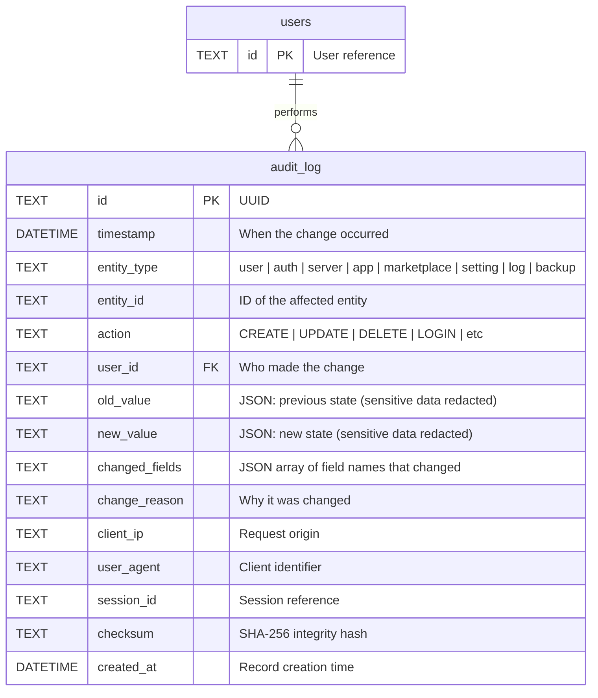

# Audit Log (Unified)

## Entity Relationship Diagram

## Entity Types

| entity_type | Tracks |
|-------------|--------|
| `user` | User CRUD, role changes, profile updates |
| `auth` | Login, logout, failed login, password change, 2FA |
| `server` | Server CRUD, credential changes, connections |
| `app` | Application CRUD, install/uninstall, start/stop |
| `marketplace` | Repo CRUD, app imports, ratings, syncs |
| `setting` | System and user setting changes |
| `log` | Log retention actions (purge, export) |
| `backup` | Backup and restore operations |

## Actions

| Action | Description |
|--------|-------------|
| `CREATE` | Entity created |
| `UPDATE` | Entity modified |
| `DELETE` | Entity deleted |
| `LOGIN` | User login success |
| `LOGOUT` | User logout |
| `LOGIN_FAILED` | Failed login attempt |
| `PASSWORD_CHANGE` | Password updated |
| `INSTALL` | App installed on server |
| `UNINSTALL` | App removed from server |
| `START` | Container started |
| `STOP` | Container stopped |
| `IMPORT` | Marketplace app imported |
| `SYNC` | Marketplace repo synced |
| `PURGE` | Logs/data purged |
| `EXPORT` | Data exported |
| `BACKUP` | Backup created |
| `RESTORE` | Backup restored |
| `CONNECT` | Server connection established |
| `DISCONNECT` | Server disconnected |
| `CREDENTIAL_CHANGE` | Server credentials updated |

## Table

### `audit_log`
Unified audit trail for all system changes.

| Column | Type | Constraints | Description |
|--------|------|-------------|-------------|
| `id` | TEXT | PRIMARY KEY | UUID |
| `timestamp` | DATETIME | NOT NULL | When the change occurred |
| `entity_type` | TEXT | NOT NULL | user\|auth\|server\|app\|marketplace\|setting\|log\|backup |
| `entity_id` | TEXT | NOT NULL | ID of affected entity |
| `action` | TEXT | NOT NULL | CREATE\|UPDATE\|DELETE\|LOGIN\|etc |
| `user_id` | TEXT | FK | Who made the change |
| `old_value` | TEXT | | JSON previous state (redacted) |
| `new_value` | TEXT | | JSON new state (redacted) |
| `changed_fields` | TEXT | | JSON array of changed field names |
| `change_reason` | TEXT | | Why it was changed |
| `client_ip` | TEXT | | Request origin |
| `user_agent` | TEXT | | Client identifier |
| `session_id` | TEXT | | Session reference |
| `checksum` | TEXT | NOT NULL | SHA-256 integrity hash |
| `created_at` | DATETIME | NOT NULL | Record creation time |

**Indexes:** `idx_audit_timestamp`, `idx_audit_entity`, `idx_audit_user`, `idx_audit_action`, `idx_audit_type_action`, `idx_audit_checksum`
**Constraints:** CHECK constraints for entity_type, action values; checksum length = 64
**Retention:** Configured via `system_settings.retention.audit_log_days`

## Design Notes

- **Sensitive Data Redaction**: Passwords, private keys, and other sensitive data are redacted in `old_value`/`new_value` fields
- **Integrity Checksums**: SHA-256 hash ensures tamper detection
- **Retention Policy**: Managed via `system_settings`, not hardcoded
