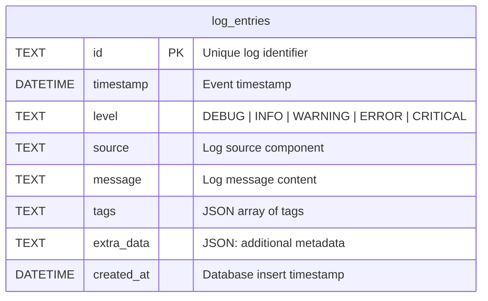

# System Logs

## Entity Relationship Diagram

## Table

### `log_entries`
System event logs.

| Column | Type | Constraints | Description |
|--------|------|-------------|-------------|
| `id` | TEXT | PRIMARY KEY | Log identifier |
| `timestamp` | DATETIME | NOT NULL | Event timestamp |
| `level` | TEXT | NOT NULL | Log level |
| `source` | TEXT | NOT NULL | Source component |
| `message` | TEXT | NOT NULL | Log message |
| `tags` | TEXT | | JSON array of tags |
| `extra_data` | TEXT | | JSON metadata |
| `created_at` | DATETIME | NOT NULL | Insert timestamp |

**Indexes:** `level`, `source`, `idx_logs_timestamp`, `idx_logs_level_source`

## Log Levels

| Level | Description |
|-------|-------------|
| `DEBUG` | Detailed debugging information |
| `INFO` | General operational messages |
| `WARNING` | Warning conditions |
| `ERROR` | Error conditions |
| `CRITICAL` | Critical conditions requiring immediate attention |

## Usage

The `log_entries` table stores operational logs from the system. These are different from the `audit_log` table:

- **`log_entries`**: Operational/diagnostic logs (errors, warnings, info)
- **`audit_log`**: Security audit trail (who did what, when)

Retention is managed via `system_settings.retention.logs_days`.
