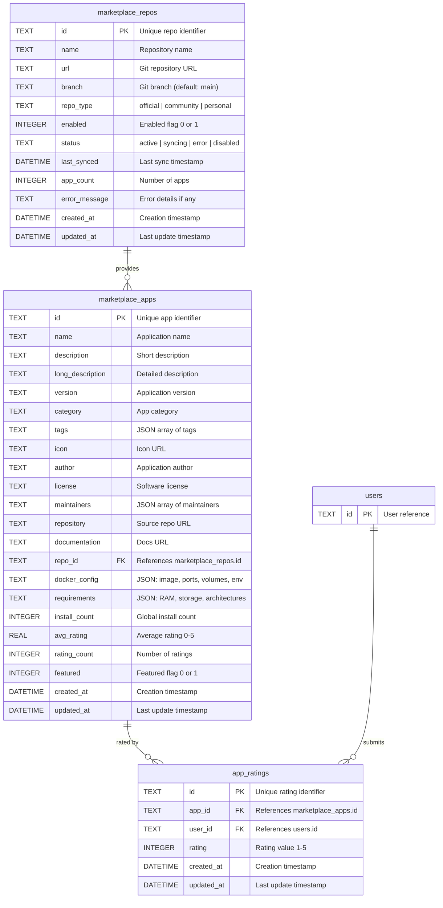

# Marketplace

## Entity Relationship Diagram

## Tables

### `marketplace_repos`
External app repository configurations.

| Column | Type | Constraints | Description |
|--------|------|-------------|-------------|
| `id` | TEXT | PRIMARY KEY | Repository identifier |
| `name` | TEXT | NOT NULL | Display name |
| `url` | TEXT | NOT NULL | Git URL |
| `branch` | TEXT | NOT NULL, DEFAULT 'main' | Git branch |
| `repo_type` | TEXT | NOT NULL, DEFAULT 'community' | official\|community\|personal |
| `enabled` | INTEGER | NOT NULL, DEFAULT 1 | Enabled flag |
| `status` | TEXT | NOT NULL, DEFAULT 'active' | Sync status |
| `last_synced` | DATETIME | | Last sync time |
| `app_count` | INTEGER | NOT NULL, DEFAULT 0 | App count |
| `error_message` | TEXT | | Error details |
| `created_at` | DATETIME | NOT NULL | Creation timestamp |
| `updated_at` | DATETIME | NOT NULL | Last update |

---

### `marketplace_apps`
Applications from marketplace repositories.

| Column | Type | Constraints | Description |
|--------|------|-------------|-------------|
| `id` | TEXT | PRIMARY KEY | Application identifier |
| `name` | TEXT | NOT NULL | Application name |
| `description` | TEXT | NOT NULL | Short description |
| `long_description` | TEXT | | Detailed description |
| `version` | TEXT | NOT NULL | Version string |
| `category` | TEXT | NOT NULL | Category name |
| `tags` | TEXT | | JSON array of tags |
| `icon` | TEXT | | Icon URL |
| `author` | TEXT | NOT NULL | Author name |
| `license` | TEXT | NOT NULL | License type |
| `maintainers` | TEXT | | JSON array of maintainers |
| `repository` | TEXT | | Source repo URL |
| `documentation` | TEXT | | Docs URL |
| `repo_id` | TEXT | NOT NULL, FK | Repository reference |
| `docker_config` | TEXT | NOT NULL | JSON Docker config |
| `requirements` | TEXT | | JSON requirements |
| `install_count` | INTEGER | NOT NULL, DEFAULT 0 | Install count |
| `avg_rating` | REAL | | Average rating |
| `rating_count` | INTEGER | NOT NULL, DEFAULT 0 | Number of ratings |
| `featured` | INTEGER | NOT NULL, DEFAULT 0 | Featured flag |
| `created_at` | DATETIME | NOT NULL | Creation timestamp |
| `updated_at` | DATETIME | NOT NULL | Last update |

**Indexes:** `category`, `repo_id`
**Foreign Keys:** `repo_id` → `marketplace_repos(id)`

---

### `app_ratings`
User ratings for marketplace apps.

| Column | Type | Constraints | Description |
|--------|------|-------------|-------------|
| `id` | TEXT | PRIMARY KEY | Rating identifier |
| `app_id` | TEXT | NOT NULL, FK | Application reference |
| `user_id` | TEXT | NOT NULL | User identifier |
| `rating` | INTEGER | NOT NULL | Rating (1-5) |
| `created_at` | DATETIME | NOT NULL | Creation timestamp |
| `updated_at` | DATETIME | NOT NULL | Last update |

**Indexes:** `app_id`, `user_id`
**Foreign Keys:** `app_id` → `marketplace_apps(id)`
**Constraints:** UNIQUE(app_id, user_id)
