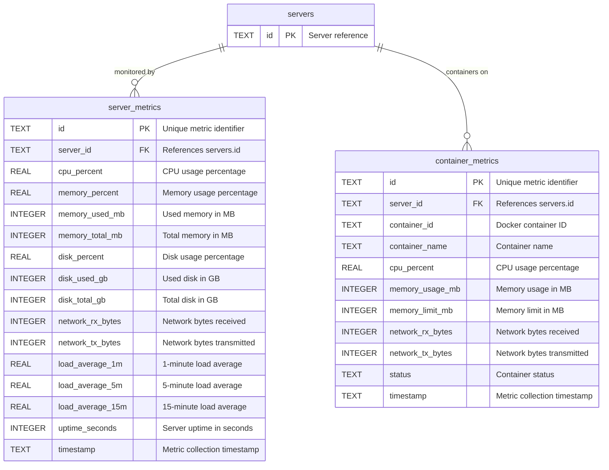

# Metrics & Monitoring

## Entity Relationship Diagram

## Tables

### `server_metrics`
Server resource usage snapshots.

| Column | Type | Constraints | Description |
|--------|------|-------------|-------------|
| `id` | TEXT | PRIMARY KEY | Metric identifier |
| `server_id` | TEXT | NOT NULL, FK | Server reference |
| `cpu_percent` | REAL | NOT NULL | CPU usage % |
| `memory_percent` | REAL | NOT NULL | Memory usage % |
| `memory_used_mb` | INTEGER | NOT NULL | Used memory (MB) |
| `memory_total_mb` | INTEGER | NOT NULL | Total memory (MB) |
| `disk_percent` | REAL | NOT NULL | Disk usage % |
| `disk_used_gb` | INTEGER | NOT NULL | Used disk (GB) |
| `disk_total_gb` | INTEGER | NOT NULL | Total disk (GB) |
| `network_rx_bytes` | INTEGER | DEFAULT 0 | Bytes received |
| `network_tx_bytes` | INTEGER | DEFAULT 0 | Bytes transmitted |
| `load_average_1m` | REAL | | 1-min load avg |
| `load_average_5m` | REAL | | 5-min load avg |
| `load_average_15m` | REAL | | 15-min load avg |
| `uptime_seconds` | INTEGER | | Server uptime |
| `timestamp` | TEXT | NOT NULL | Collection time |

**Indexes:** `idx_server_metrics_server`, `idx_server_metrics_timestamp`
**Foreign Keys:** `server_id` → `servers(id)` ON DELETE CASCADE

---

### `container_metrics`
Docker container resource usage.

| Column | Type | Constraints | Description |
|--------|------|-------------|-------------|
| `id` | TEXT | PRIMARY KEY | Metric identifier |
| `server_id` | TEXT | NOT NULL, FK | Server reference |
| `container_id` | TEXT | NOT NULL | Container ID |
| `container_name` | TEXT | NOT NULL | Container name |
| `cpu_percent` | REAL | NOT NULL | CPU usage % |
| `memory_usage_mb` | INTEGER | NOT NULL | Memory usage (MB) |
| `memory_limit_mb` | INTEGER | NOT NULL | Memory limit (MB) |
| `network_rx_bytes` | INTEGER | DEFAULT 0 | Bytes received |
| `network_tx_bytes` | INTEGER | DEFAULT 0 | Bytes transmitted |
| `status` | TEXT | NOT NULL | Container status |
| `timestamp` | TEXT | NOT NULL | Collection time |

**Indexes:** `idx_container_metrics_server`, `idx_container_metrics_timestamp`
**Foreign Keys:** `server_id` → `servers(id)` ON DELETE CASCADE
