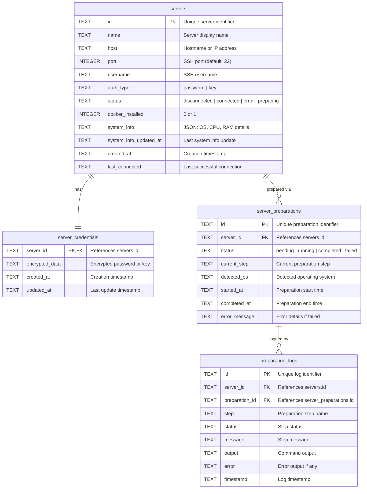

# Server Management

## Entity Relationship Diagram

## Tables

### `servers`
Stores server connection information and system details.

| Column | Type | Constraints | Description |
|--------|------|-------------|-------------|
| `id` | TEXT | PRIMARY KEY | Unique server identifier |
| `name` | TEXT | NOT NULL | Display name |
| `host` | TEXT | NOT NULL | Hostname or IP |
| `port` | INTEGER | NOT NULL, DEFAULT 22 | SSH port |
| `username` | TEXT | NOT NULL | SSH username |
| `auth_type` | TEXT | NOT NULL, CHECK (password\|key) | Authentication method |
| `status` | TEXT | NOT NULL, DEFAULT 'disconnected' | Connection status |
| `docker_installed` | INTEGER | NOT NULL, DEFAULT 0 | Docker availability |
| `system_info` | TEXT | | JSON system details |
| `system_info_updated_at` | TEXT | | Last system info refresh |
| `created_at` | TEXT | NOT NULL | Creation timestamp |
| `last_connected` | TEXT | | Last connection timestamp |

**Indexes:** `idx_servers_status`, `idx_servers_host`, `idx_servers_docker`
**Constraints:** UNIQUE(host, port, username)

---

### `server_credentials`
Stores encrypted server authentication credentials.

| Column | Type | Constraints | Description |
|--------|------|-------------|-------------|
| `server_id` | TEXT | PRIMARY KEY, FK | References servers.id |
| `encrypted_data` | TEXT | NOT NULL | Encrypted credentials |
| `created_at` | TEXT | NOT NULL | Creation timestamp |
| `updated_at` | TEXT | NOT NULL | Last update |

**Foreign Keys:** `server_id` → `servers(id)` ON DELETE CASCADE

---

### `server_preparations`
Server setup process tracking.

| Column | Type | Constraints | Description |
|--------|------|-------------|-------------|
| `id` | TEXT | PRIMARY KEY | Preparation identifier |
| `server_id` | TEXT | NOT NULL, FK | Server reference |
| `status` | TEXT | NOT NULL, DEFAULT 'pending' | Preparation status |
| `current_step` | TEXT | | Current step name |
| `detected_os` | TEXT | | Detected OS |
| `started_at` | TEXT | | Start timestamp |
| `completed_at` | TEXT | | End timestamp |
| `error_message` | TEXT | | Error details |

**Indexes:** `idx_preparations_server`, `idx_preparations_status`
**Foreign Keys:** `server_id` → `servers(id)` ON DELETE CASCADE

---

### `preparation_logs`
Server preparation step logs.

| Column | Type | Constraints | Description |
|--------|------|-------------|-------------|
| `id` | TEXT | PRIMARY KEY | Log identifier |
| `server_id` | TEXT | NOT NULL, FK | Server reference |
| `preparation_id` | TEXT | NOT NULL, FK | Preparation reference |
| `step` | TEXT | NOT NULL | Step name |
| `status` | TEXT | NOT NULL | Step status |
| `message` | TEXT | NOT NULL | Step message |
| `output` | TEXT | | Command output |
| `error` | TEXT | | Error output |
| `timestamp` | TEXT | NOT NULL | Log timestamp |

**Indexes:** `idx_prep_logs_server`, `idx_prep_logs_preparation`
**Foreign Keys:**
- `server_id` → `servers(id)` ON DELETE CASCADE
- `preparation_id` → `server_preparations(id)` ON DELETE CASCADE
