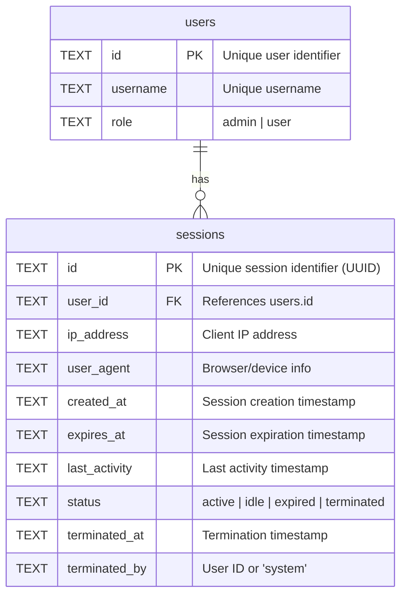

# Sessions

## Entity Relationship Diagram



## Table

### `sessions`
Persistent user session storage for authentication tracking.

| Column | Type | Constraints | Description |
|--------|------|-------------|-------------|
| `id` | TEXT | PRIMARY KEY | Unique session identifier (UUID) |
| `user_id` | TEXT | NOT NULL, FK | References users.id |
| `ip_address` | TEXT | | Client IP address |
| `user_agent` | TEXT | | Browser/device information |
| `created_at` | TEXT | NOT NULL, DEFAULT datetime('now') | Session start time |
| `expires_at` | TEXT | NOT NULL | Session expiration time |
| `last_activity` | TEXT | NOT NULL, DEFAULT datetime('now') | Last activity timestamp |
| `status` | TEXT | NOT NULL, DEFAULT 'active', CHECK | active\|idle\|expired\|terminated |
| `terminated_at` | TEXT | | When session was terminated |
| `terminated_by` | TEXT | | User ID who terminated or 'system' |

**Indexes:** `idx_sessions_user_id`, `idx_sessions_status`, `idx_sessions_expires_at`, `idx_sessions_last_activity`

**Foreign Keys:** `user_id` → `users(id)` ON DELETE CASCADE

---

## Session Status

| Status | Description |
|--------|-------------|
| `active` | Session is valid and in use |
| `idle` | Session is valid but inactive |
| `expired` | Session has passed expiration time |
| `terminated` | Session was explicitly ended |

---

## Session Lifecycle

```
┌───────────────────────────────────────────────────────────────────────┐
│                          SESSION LIFECYCLE                             │
├───────────────────────────────────────────────────────────────────────┤
│                                                                       │
│   Login                                                               │
│     │                                                                 │
│     ▼                                                                 │
│  ┌─────────┐   inactive > timeout   ┌─────────┐                      │
│  │ ACTIVE  │───────────────────────►│  IDLE   │                      │
│  └────┬────┘                        └────┬────┘                      │
│       │ ▲           activity             │ │                          │
│       │ └────────────────────────────────┘ │                          │
│       │                                    │                          │
│       │ expires_at passed                  │ expires_at passed        │
│       │ OR user logout                     │ OR user logout           │
│       │ OR admin terminate                 │ OR admin terminate       │
│       ▼                                    ▼                          │
│  ┌─────────────┐                   ┌─────────────┐                   │
│  │ TERMINATED  │                   │  EXPIRED    │                   │
│  └─────────────┘                   └─────────────┘                   │
│       │                                  │                            │
│       └──────────────┬───────────────────┘                            │
│                      ▼                                                │
│               (soft deleted)                                          │
│                                                                       │
└───────────────────────────────────────────────────────────────────────┘
```

**Key points:**
- Sessions are created on successful login
- `last_activity` updates on API calls
- Status changes to `idle` when inactive for longer than the idle timeout (default 15 minutes)
- Status changes to `expired` when `expires_at` passes
- Status changes to `terminated` on explicit logout or admin action
- Soft delete pattern: records remain for audit, status indicates state

### Idle Detection

**Important distinction:**
- `last_activity` is a **timestamp field** stored in the database (e.g., "2026-01-18 05:30:00")
- `idle` is a **derived status** computed by comparing `last_activity` against the idle timeout threshold

| Concept | Type | Example | Description |
|---------|------|---------|-------------|
| `last_activity` | Timestamp | "5 minutes ago" | When the session last had activity |
| `idle` (status) | Derived state | orange dot | Set when `last_activity` exceeds idle timeout |

Sessions are automatically marked as `idle` when:
```
current_time - last_activity > idle_timeout
```

This happens every time `list_sessions` is called.

| Setting Key | Default | Description |
|-------------|---------|-------------|
| `security.session_idle_timeout` | 900 seconds (15 min) | Time before a session is marked idle |

**Example:**
- Session with `last_activity` = 5 minutes ago → status = `active` (green)
- Session with `last_activity` = 20 minutes ago → status = `idle` (orange)

---

## MCP Tools

### Session Tools (`tools/session/`)

| Tool | Description | Auth Required | Admin Only |
|------|-------------|---------------|------------|
| `list_sessions` | List sessions for a user | Yes | No* |
| `get_session` | Get a single session by ID | Yes | No* |
| `update_session` | Update session last_activity | Yes | No* |
| `delete_session` | Terminate one or more sessions | Yes | No* |
| `cleanup_expired_sessions` | Mark expired sessions | Yes | Yes |

*Users can only access their own sessions. Admins can access any user's sessions.

### Tool Parameters

**list_sessions:**
- `user_id`: Optional - Admin can specify target user (default: current user)
- `status`: Optional - Filter by status

**get_session:**
- `session_id`: Required - Session ID to retrieve

**update_session:**
- `session_id`: Required - Session ID to update

**delete_session:**
- `session_id`: Optional - Delete specific session
- `user_id`: Optional - Admin: delete all sessions for user
- `all`: Optional - Delete all own sessions (default: false)
- `exclude_current`: Optional - Keep current session (default: true)

**cleanup_expired_sessions:**
- No parameters - marks all expired sessions

---

## Service Methods

### SessionService (`services/session_service.py`)

```python
class SessionService:
    async def create_session(
        self,
        user_id: str,
        expires_at: datetime,
        ip_address: Optional[str] = None,
        user_agent: Optional[str] = None
    ) -> Session

    async def get_session(self, session_id: str) -> Optional[Session]

    async def list_sessions(
        self,
        user_id: Optional[str] = None,
        status: Optional[SessionStatus] = None
    ) -> List[SessionListResponse]
    # Note: Automatically calls mark_idle_sessions() before listing

    async def update_session(self, session_id: str) -> bool

    async def delete_session(
        self,
        session_id: Optional[str] = None,
        user_id: Optional[str] = None,
        terminated_by: Optional[str] = None,
        exclude_session_id: Optional[str] = None
    ) -> int

    async def cleanup_expired_sessions(self) -> int

    async def validate_session(self, session_id: str) -> Optional[Session]

    # Idle detection methods
    async def get_idle_timeout_seconds(self) -> int
    # Returns idle timeout from settings or default (900 seconds)

    async def mark_idle_sessions(self) -> int
    # Marks active sessions as idle if last_activity exceeds timeout
```

---

## Data Flow

```
┌─────────────────────────────────────────────────────────────────────────┐
│                            SESSION DATA FLOW                             │
├─────────────────────────────────────────────────────────────────────────┤
│                                                                         │
│  User Login                                                             │
│       │                                                                 │
│       ▼                                                                 │
│  ┌─────────────┐                                                        │
│  │ AuthService │                                                        │
│  │  .login()   │                                                        │
│  └──────┬──────┘                                                        │
│         │                                                               │
│         │ authenticate user                                             │
│         ▼                                                               │
│  ┌────────────────┐                                                     │
│  │ SessionService │                                                     │
│  │ .create_session│                                                     │
│  └───────┬────────┘                                                     │
│          │                                                              │
│          │ INSERT INTO sessions                                         │
│          ▼                                                              │
│  ┌────────────────────────────────────────┐                            │
│  │           SQLite Database              │                            │
│  │                                        │                            │
│  │  sessions                              │                            │
│  │    id, user_id, status, expires_at...  │                            │
│  │                                        │                            │
│  └────────────────────────────────────────┘                            │
│                                                                         │
│  Frontend API Call                                                      │
│       │                                                                 │
│       ▼                                                                 │
│  ┌─────────────────┐                                                    │
│  │  MCP Session    │                                                    │
│  │  Tools          │                                                    │
│  └────────┬────────┘                                                    │
│           │                                                             │
│           ├─── list_sessions ──► User's sessions                       │
│           ├─── get_session ────► Single session                        │
│           ├─── update_session ─► Update last_activity                  │
│           └─── delete_session ─► Terminate session(s)                  │
│                                                                         │
└─────────────────────────────────────────────────────────────────────────┘
```

---

## Integration with Auth

Sessions are created during the login process in `AuthService.authenticate_user()`:

```python
# In auth_service.py authenticate_user()
expires_at = datetime.now(UTC) + timedelta(hours=self.token_expiry_hours)
db_session = await self.session_service.create_session(
    user_id=user.id,
    expires_at=expires_at,
    ip_address=client_ip,
    user_agent=user_agent
)
session_id = db_session.id
```

The session ID is returned in the `LoginResponse` and used to track the user's session.

---

## Permission Model

| Operation | User | Admin |
|-----------|------|-------|
| List own sessions | Yes | Yes |
| List other user's sessions | No | Yes |
| Get own session | Yes | Yes |
| Get other user's session | No | Yes |
| Update own session | Yes | Yes |
| Update other user's session | No | Yes |
| Delete own sessions | Yes | Yes |
| Delete other user's sessions | No | Yes |
| Cleanup expired sessions | No | Yes |
