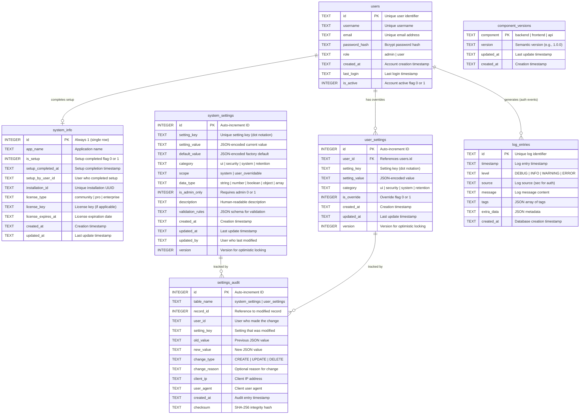

# User Management, Settings & Audit

## Entity Relationship Diagram



## Tables

### `users`
User authentication and account information.

| Column | Type | Constraints | Description |
|--------|------|-------------|-------------|
| `id` | TEXT | PRIMARY KEY | Unique user identifier |
| `username` | TEXT | UNIQUE, NOT NULL | Username |
| `email` | TEXT | UNIQUE, NOT NULL | Email address |
| `password_hash` | TEXT | NOT NULL | Bcrypt hashed password |
| `role` | TEXT | NOT NULL, DEFAULT 'user' | admin or user |
| `created_at` | TEXT | NOT NULL | Account creation timestamp |
| `last_login` | TEXT | | Last login timestamp |
| `is_active` | INTEGER | NOT NULL, DEFAULT 1 | Account active flag |

**Indexes:** `idx_users_username`, `idx_users_email`, `idx_users_role`, `idx_users_active`, `idx_users_created_at`

**Password Hashing:**
- Algorithm: bcrypt
- Cost factor: **12 rounds** (must match between backend and CLI)
- Backend: `backend/src/lib/auth_helpers.py` → `BCRYPT_ROUNDS = 12`
- CLI: `cli/src/lib/admin.ts` → `SALT_ROUNDS = 12`

---

### `system_info`
Application metadata and installation information. Single-row table enforced by CHECK constraint.

| Column | Type | Constraints | Description |
|--------|------|-------------|-------------|
| `id` | INTEGER | PRIMARY KEY, CHECK (id = 1) | Always 1 (single row) |
| `app_name` | TEXT | NOT NULL, DEFAULT 'Tomo' | Application name |
| `is_setup` | INTEGER | NOT NULL, DEFAULT 0, CHECK (0,1) | Setup completed flag |
| `setup_completed_at` | TEXT | | Setup completion timestamp |
| `setup_by_user_id` | TEXT | | User who completed setup |
| `installation_id` | TEXT | NOT NULL | Unique installation UUID |
| `license_type` | TEXT | DEFAULT 'community', CHECK | community\|pro\|enterprise |
| `license_key` | TEXT | | License key (if applicable) |
| `license_expires_at` | TEXT | | License expiration date |
| `created_at` | TEXT | NOT NULL, DEFAULT datetime('now') | Creation timestamp |
| `updated_at` | TEXT | NOT NULL, DEFAULT datetime('now') | Last update timestamp |

**Indexes:** `idx_system_info_is_setup`

**Auto-update trigger:** `system_info_updated_at` automatically updates `updated_at` on any change.

**Purpose:**
- Tracks application setup status (`is_setup`) for initial admin creation flow
- Stores installation ID for telemetry and licensing
- Single-row constraint ensures only one system_info record exists

**Setup Flow:**
1. Table created with `is_setup = 0` and auto-generated `installation_id`
2. User visits `/login` → redirected to `/setup` (needs_setup = true)
3. Admin creates account via `create_initial_admin` tool
4. System marked as setup complete (`is_setup = 1`, `setup_completed_at`, `setup_by_user_id`)
5. Future visits to `/login` show normal login page

---

### `component_versions`
Tracks installed versions of each application component (backend, frontend, api).

| Column | Type | Constraints | Description |
|--------|------|-------------|-------------|
| `component` | TEXT | PRIMARY KEY, CHECK | backend\|frontend\|api |
| `version` | TEXT | NOT NULL, DEFAULT '1.0.0' | Semantic version |
| `updated_at` | TEXT | NOT NULL, DEFAULT datetime('now') | Last update timestamp |
| `created_at` | TEXT | NOT NULL, DEFAULT datetime('now') | Creation timestamp |

**Auto-update trigger:** `component_versions_updated_at` automatically updates `updated_at` on any change.

**Purpose:**
- Tracks versions of backend, frontend, and api components independently
- Enables checking for updates against GitHub releases
- Supports version comparison for update detection

**Default Values:**
All components initialized to version `1.0.0` on table creation.

---

### `system_settings`
System-wide application settings with security constraints.

| Column | Type | Constraints | Description |
|--------|------|-------------|-------------|
| `id` | INTEGER | PRIMARY KEY AUTOINCREMENT | Setting ID |
| `setting_key` | TEXT | NOT NULL, UNIQUE | Hierarchical key (dot notation) |
| `setting_value` | TEXT | NOT NULL | JSON-encoded current value |
| `default_value` | TEXT | NOT NULL | JSON-encoded factory default |
| `category` | TEXT | NOT NULL | ui\|security\|system\|retention |
| `scope` | TEXT | NOT NULL, DEFAULT 'system' | system\|user_overridable |
| `data_type` | TEXT | NOT NULL | string\|number\|boolean\|object\|array |
| `is_admin_only` | INTEGER | NOT NULL, DEFAULT 1 | Requires admin |
| `description` | TEXT | | Human-readable description |
| `validation_rules` | TEXT | | JSON schema for validation |
| `created_at` | TEXT | NOT NULL | Creation timestamp |
| `updated_at` | TEXT | NOT NULL | Last update |
| `updated_by` | TEXT | | User who modified |
| `version` | INTEGER | NOT NULL, DEFAULT 1 | Optimistic locking version |

**Indexes:** `idx_system_settings_key`, `idx_system_settings_category`, `idx_system_settings_scope`

**Reset Logic:**
- User reset: Delete from `user_settings` → falls back to `system_settings.setting_value`
- System reset: Copy `default_value` → `setting_value`

---

### `user_settings`
User-specific setting overrides.

| Column | Type | Constraints | Description |
|--------|------|-------------|-------------|
| `id` | INTEGER | PRIMARY KEY AUTOINCREMENT | Setting ID |
| `user_id` | TEXT | NOT NULL, FK | User reference |
| `setting_key` | TEXT | NOT NULL | Setting key (dot notation) |
| `setting_value` | TEXT | NOT NULL | JSON-encoded value |
| `category` | TEXT | NOT NULL | Setting category |
| `is_override` | INTEGER | NOT NULL, DEFAULT 1 | Override flag |
| `created_at` | TEXT | NOT NULL | Creation timestamp |
| `updated_at` | TEXT | NOT NULL | Last update |
| `version` | INTEGER | NOT NULL, DEFAULT 1 | Optimistic locking version |

**Indexes:** `idx_user_settings_user_id`, `idx_user_settings_key`, `idx_user_settings_category`
**Foreign Keys:** `user_id` → `users(id)` ON DELETE CASCADE
**Constraints:** UNIQUE(user_id, setting_key)

---

### `settings_audit`
Tamper-resistant audit trail for settings changes.

| Column | Type | Constraints | Description |
|--------|------|-------------|-------------|
| `id` | INTEGER | PRIMARY KEY AUTOINCREMENT | Audit entry ID |
| `table_name` | TEXT | NOT NULL | system_settings\|user_settings |
| `record_id` | INTEGER | NOT NULL, >= 0 | Reference to modified record |
| `user_id` | TEXT | | User who made the change |
| `setting_key` | TEXT | NOT NULL | Setting that was modified |
| `old_value` | TEXT | | Previous JSON value (null for CREATE) |
| `new_value` | TEXT | NOT NULL | New JSON value |
| `change_type` | TEXT | NOT NULL | CREATE\|UPDATE\|DELETE |
| `change_reason` | TEXT | max 500 chars | Optional reason for change |
| `client_ip` | TEXT | | Client IP address |
| `user_agent` | TEXT | | Client user agent |
| `created_at` | TEXT | NOT NULL | Audit entry timestamp |
| `checksum` | TEXT | NOT NULL, 64 chars | SHA-256 integrity hash |

**Indexes:** `idx_settings_audit_table_record`, `idx_settings_audit_user_id`, `idx_settings_audit_setting_key`, `idx_settings_audit_created_at`

**Security Features:**
- Checksum prevents tampering with historical records
- Change type constraints prevent invalid values
- Setting key format validation

---

### `log_entries`
Application logs including authentication events.

| Column | Type | Constraints | Description |
|--------|------|-------------|-------------|
| `id` | TEXT | PRIMARY KEY | Unique log identifier |
| `timestamp` | TEXT | NOT NULL | Log entry timestamp |
| `level` | TEXT | NOT NULL | DEBUG\|INFO\|WARNING\|ERROR |
| `source` | TEXT | NOT NULL | Log source (sec = security/auth) |
| `message` | TEXT | NOT NULL | Log message content |
| `tags` | TEXT | | JSON array of tags |
| `extra_data` | TEXT | | JSON metadata |
| `created_at` | TEXT | NOT NULL | Database creation timestamp |

**Indexes:** `idx_logs_timestamp`, `idx_logs_level_source`

**Auth Events (source='sec'):**
Auth events are stored in `log_entries` with `source='sec'` and metadata containing:
- `event_type`: LOGIN, LOGOUT, etc.
- `username`: User involved in the event
- `success`: true/false
- `client_ip`: Client IP address
- `user_agent`: Client user agent

---

## CLI Tools

The Tomo CLI provides direct database access for user management operations that don't require a running backend server.

See [CLI Documentation](../../cli/README.md) for full details.

### Admin Commands (`tomo admin`)

| Command | Description | Use Case |
|---------|-------------|----------|
| `tomo admin create` | Create new admin user | Initial setup, adding admins |

### User Commands (`tomo user`)

| Command | Description | Use Case |
|---------|-------------|----------|
| `tomo user reset-password` | Reset any user's password | Password recovery, lockout recovery |

**When to use CLI vs MCP:**
- **CLI**: Initial setup, password recovery, offline operations, automation scripts
- **MCP**: Runtime operations, authenticated sessions, frontend integration

---

## MCP Tools

### Auth Tools (`tools/auth/`)

| Tool | Description | Auth Required |
|------|-------------|---------------|
| `login` | Authenticate user with credentials | No |
| `logout` | End user session | Yes |
| `get_current_user` | Get authenticated user info | Yes |
| `create_initial_admin` | Create first admin user during setup | No* |

*`create_initial_admin` only works when `system_info.is_setup = 0`

### System Tools (`tools/system/`)

| Tool | Description | Auth Required |
|------|-------------|---------------|
| `get_system_setup` | Get system setup status | No |
| `get_system_info` | Get application metadata | No |
| `get_system_version` | Get currently installed version | No |
| `get_system_updates` | Get available updates from GitHub | No |
| `get_system_patch_history` | Get patch installation history | No |
| `get_system_patch_details` | Get patch details with audit trail | No |

### Settings Tools (`tools/settings/`)

| Tool | Description | Auth Required | Admin Only |
|------|-------------|---------------|------------|
| `get_settings` | Get settings (system + user overrides) | Yes | No |
| `update_settings` | Update user settings | Yes | No |
| `reset_user_settings` | Delete user overrides | Yes | No |
| `reset_system_settings` | Reset system to factory defaults | Yes | Yes |
| `get_default_settings` | Get factory default values | No | No |

### Audit Tools (`tools/audit/`)

| Tool | Description | Auth Required | Admin Only |
|------|-------------|---------------|------------|
| `get_settings_audit` | Get settings change history | Yes | Yes |
| `get_auth_audit` | Get authentication event history | Yes | Yes |

**Audit Tool Parameters:**

`get_settings_audit`:
- `setting_key`: Filter by specific setting
- `filter_user_id`: Filter by user who made changes
- `limit`: Max entries (default 100)
- `offset`: Pagination offset

`get_auth_audit`:
- `event_type`: Filter by event (LOGIN, LOGOUT)
- `username`: Filter by username
- `success_only`: Filter by success/failure
- `limit`: Max entries (default 100)
- `offset`: Pagination offset

---

## Frontend Clients

### SettingsMcpClient (`services/settingsMcpClient.ts`)

```typescript
class SettingsMcpClient {
  getSettings(userId?): Promise<SettingsUpdateResult>
  updateSettings(userId, updates, options?): Promise<SettingsUpdateResult>
  validateSettings(settings): Promise<SettingsValidation>
  getSettingsSchema(): Promise<SettingsSchema | null>
  resetUserSettings(userId?, category?): Promise<SettingsUpdateResult>
  resetSystemSettings(userId?, category?): Promise<SettingsUpdateResult>
  getDefaultSettings(category?): Promise<{success, defaults?, error?}>
  initializeDatabase(): Promise<boolean>
  isBackendConnected(): boolean
}
```

### AuditMcpClient (`services/auditMcpClient.ts`)

```typescript
class AuditMcpClient {
  getSettingsAudit(filterUserId?, settingKey?, limit?, offset?): Promise<SettingsAuditEntry[]>
  getAuthAudit(eventType?, username?, successOnly?, limit?, offset?): Promise<AuthAuditEntry[]>
  isBackendConnected(): boolean
}
```

---

## Data Flow

```
┌─────────────────────────────────────────────────────────────────────────────┐
│                              DATA FLOW                                       │
├─────────────────────────────────────────────────────────────────────────────┤
│                                                                             │
│  User Action                                                                │
│       │                                                                     │
│       ├─────────────────────────────────┐                                   │
│       ▼                                 ▼                                   │
│  ┌─────────────┐     ┌──────────┐  ┌─────────────┐                         │
│  │  Frontend   │     │   CLI    │  │   Backend   │                         │
│  │  Client     │     │ (admin)  │  │   Server    │                         │
│  └──────┬──────┘     └────┬─────┘  └──────┬──────┘                         │
│         │                 │               │                                 │
│         ▼                 │               ▼                                 │
│  ┌──────────────┐         │        ┌─────────────┐                         │
│  │  MCP Tools   │         │        │  Services   │                         │
│  └──────┬───────┘         │        └──────┬──────┘                         │
│         │                 │               │                                 │
│         └─────────────────┼───────────────┘                                 │
│                           │                                                 │
│                           ▼                                                 │
│         ┌─────────────────────────────────────────────┐                    │
│         │              SQLite Database                 │                    │
│         ├─────────────────────────────────────────────┤                    │
│         │                                             │                    │
│         │  users ◄──────────────► user_settings       │                    │
│         │    │                         │              │                    │
│         │    │ (CLI: create,           │              │                    │
│         │    │  reset password)        │              │                    │
│         │    │                         │              │                    │
│         │  system_settings ◄───────────┤              │                    │
│         │       │                      │              │                    │
│         │       └──────────┬───────────┘              │                    │
│         │                  │                          │                    │
│         │                  ▼                          │                    │
│         │          settings_audit                     │                    │
│         │                                             │                    │
│         │  log_entries (auth events via source='sec') │                    │
│         │                                             │                    │
│         └─────────────────────────────────────────────┘                    │
│                                                                             │
└─────────────────────────────────────────────────────────────────────────────┘
```
